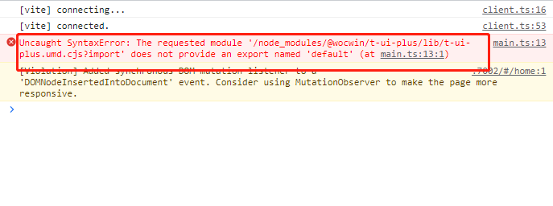

### 快速上手

::: tip 提示

fengmao-ui 基于 vue3 + ts + Element-plus 再次封装的基础组件

:::

### 安装

```bash:no-line-numbers
npm install fengmao-ui -S
&
pnpm add fengmao-ui -S
```

### 使用

```js
// main.ts
import fengmaoUi from 'fengmao-ui'
import 'fengmao-ui/lib/style.css'
const app = createApp(App)
app.use(fengmaoUi)
app.mount('#app')
```

### fengmao-ui 组件 Volar 类型提示

```js
// 需要在使用的项目的tsconfig.json文件中添加以下
compilerOptions：{
  "types": [
      "fengmao-ui/components.d.ts",
    ],
}

```

### 🔨 Vue3 + Vite 项目中安装引入报如下错误的解决方法

> #### 把项目的 vite 版本升级到 4+



### docs 文档结构目录

```
├─ examples               # VPDemo组件自动解析此文件夹下的所有.vue文件
├─ components             # .md文件
├─ public                 # 静态资源文件
├─ .vitepress
│  ├─ config              # 插件配置
|  │  ├─ global.ts        # 全局变量定义
|  │  └─ plugins.ts       # 自定义.md文件渲染
│  ├─ theme               # 主题配置
│  ├─ utils               # 文档展开隐藏代码高亮
│  ├─ vitepress
|  │  ├─ vp-demo          # VPDemo组件源码
|  │  ├─ style            # VPDemo组件样式
|  │  └─ index.ts         # 暴露VPDemo组件
│  └─ config.ts           # vitepress配置文件
├─ index.md               # 文档home页面
├─ tsconfig.json          # typescript 全局配置
└─ vite.config.ts         # vite 全局配置文件（支持tsx）
```

### vue2 基础组件

> 基于 vue2 + Element-ui 和 ant-design-vue 二次封装的基础组件

---

#### [Vue2 基础组件文档地址](https://wocwin.github.io/t-ui/)

---

#### [Vue2 基础组件码云地址](https://gitee.com/wocwin/t-ui)

---

#### [Vue2 基础组件 GitHub 地址](https://github.com/wocwin/t-ui)
